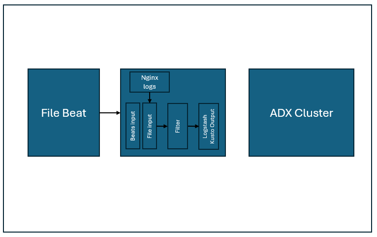

# Introduction and Quickstart

This document is meant for quickly bootstrapping and getting up and running with the logstash-output-kusto plugin.The following shows the layput of the components involved in the setup.


## Installation pre-requisites

The following are the installation pre-requisites.
    - [Docker](https://docs.docker.com/get-docker/)
    - [Docker compose](https://docs.docker.com/compose/install/)
  
## ADX/Kusto pre-requisites

The document assumes that there is a provisioned ADX cluster and AAD application with required permissions is set up
    - Steps to register the AAD App can be found [here](https://learn.microsoft.com/en-us/azure/data-explorer/provision-azure-ad-app)

## Running the plugin

The following walks through the steps to get the kusto output plugin running in docker. The set up consists of a filebeat agent and a file input plugin that reads input data and forwards the telemetry to an ADX cluster.

1. Clone the repository and navigate to the docker quickstart folder

    ```bash
        git clone https://github.com/Azure/logstash-output-kusto.git
        cd logstash-output-kusto\quickstart\docker
    ```

2. Download the logstash [kusto plugin gem](https://github.com/Azure/logstash-output-kusto/releases) and place it as logstash-output-kusto.gem in the docker folder.

3. Create a table in the target database in ADX. This creates a table Logs and a json mapping for the ingestion referenced in the env file.

```sql
.create-merge table Logs(proctimestamp:string , message:string,type:string)       

.create table Logs ingestion json mapping 'basicmsgmapping' '[{"column":"proctimestamp","path":"$.@timestamp","datatype":"string","transform":null},{"column":"message","path":"$.message","datatype":"string","transform":null},{"column":"type","path":"$.type","datatype":"string","transform":null}]'         
```

4. Edit the [.env file](conf/.env) and fill in the details corresponding to the setup.

```bash
AAD_APP_ID=3
AAD_APP_KEY=
AAD_TENANT=72f988bf-86f1-41af-91ab-2d7cd011db47
ADX_INGEST_URL=https://ingest-<>
ADX_DB=<DB>
ADX_TABLE=Logs
ADX_TABLE_MAPPING=basicmsgmapping 
```

5. Run docker compose to start the setup.

```bash
docker compose up --build -d
```

With all going well, the container logs of __ls-adx__ should resemble the following

```bash
[2023-07-13T11:52:39,997][INFO ][logstash.outputs.kusto   ][main] Preparing Kusto resources.
[2023-07-13T11:52:40,564][INFO ][com.microsoft.azure.kusto.ingest.QueuedIngestClientImpl][main] Creating a new IngestClient
[2023-07-13T11:52:40,570][INFO ][com.microsoft.azure.kusto.data.HttpClientFactory][main] Creating new CloseableHttpClient client
[2023-07-13T11:52:40,946][INFO ][com.microsoft.azure.kusto.ingest.ResourceManager][main] Refreshing Ingestion Auth Token
[2023-07-13T11:52:41,401][INFO ][logstash.filters.json    ][main] ECS compatibility is enabled but `target` option was not specified. This may cause fields to be set at the top-level of the event where they are likely to clash with the Elastic Common Schema. It is recommended to set the `target` option to avoid potential schema conflicts (if your data is ECS compliant or non-conflicting, feel free to ignore this message)
[2023-07-13T11:52:41,402][WARN ][logstash.filters.grok    ][main] ECS v8 support is a preview of the unreleased ECS v8, and uses the v1 patterns. When Version 8 of the Elastic Common Schema becomes available, this plugin will need to be updated
[2023-07-13T11:52:41,542][INFO ][logstash.javapipeline    ][main] Starting pipeline {:pipeline_id=>"main", "pipeline.workers"=>8, "pipeline.batch.size"=>125, "pipeline.batch.delay"=>50, "pipeline.max_inflight"=>1000, "pipeline.sources"=>["/usr/share/logstash/pipeline/logstash-kusto.config"], :thread=>"#<Thread:0x3e1519c2@/usr/share/logstash/logstash-core/lib/logstash/java_pipeline.rb:134 run>"}
[2023-07-13T11:52:42,874][INFO ][logstash.javapipeline    ][main] Pipeline Java execution initialization time {"seconds"=>1.33}
[2023-07-13T11:52:42,882][INFO ][logstash.inputs.beats    ][main] Starting input listener {:address=>"0.0.0.0:5044"}
[2023-07-13T11:52:43,072][INFO ][logstash.inputs.file     ][main] No sincedb_path set, generating one based on the "path" setting {:sincedb_path=>"/usr/share/logstash/data/plugins/inputs/file/.sincedb_1b09a6f6ec2185e5f941d20364586fb1", :path=>["/tmp/nginx.log"]}
[2023-07-13T11:52:43,076][INFO ][logstash.javapipeline    ][main] Pipeline started {"pipeline.id"=>"main"}
[2023-07-13T11:52:43,080][INFO ][filewatch.observingtail  ][main][c4d57173c9351919278c2d6d1f15eff355e443bdf7c225fbe20bc50d46af8668] START, creating Discoverer, Watch with file and sincedb collections
[2023-07-13T11:52:43,095][INFO ][logstash.agent           ] Pipelines running {:count=>1, :running_pipelines=>[:main], :non_running_pipelines=>[]}
[2023-07-13T11:52:43,157][INFO ][org.logstash.beats.Server][main][46ad93def516039067ea0203d866e2d1c4606b77a5efb59292c4b23e06834774] Starting server on port: 5044
[2023-07-13T11:52:44,228][INFO ][logstash.outputs.kusto   ][main][d18931d348bada774c24e525e9dd1d63e0079f56ade8e78fa2bbc0f930a0329f] Opening file {:path=>"/tmp/kusto/la-2023-07-13-11-52.txt.DB.Logs"}
[2023-07-13T11:52:44,230][INFO ][logstash.outputs.kusto   ][main][d18931d348bada774c24e525e9dd1d63e0079f56ade8e78fa2bbc0f930a0329f] Creating directory {:directory=>"/tmp/kusto"}
[2023-07-13T11:52:47,183][INFO ][logstash.outputs.kusto   ][main][d18931d348bada774c24e525e9dd1d63e0079f56ade8e78fa2bbc0f930a0329f] Opening file {:path=>"/tmp/kusto/la-2020-12-19-13-14.txt.DB.Logs"}
```

6. Data should flow into ADX. This can be verified by looking at the ingested rows. This should bring up a few sample rows.

```sql
Logs| take 10
```

7. Track the ingestion process and failures using the following query

```sql
.show ingestion failures
.show commands-and-queries | where Database == '<DB>' and CommandType == 'DataIngestPull' | order by StartedOn desc | take 10
```

8. Cleaning up the set up
The set up can be stopped by running

```bash
docker compose down "--remove-orphans"
``````